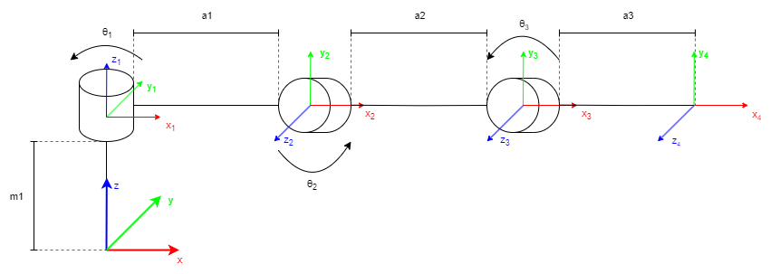

# ElkapodAlgorithms package
[](https://opensource.org/licenses/MIT)


## Overview
This project and python package associated with it hosts all self-written algorithms used in the Elkapod hexapod robot which is developed at KNR "Bionik" student research group at the faculty of Electronics and Information Technology, Warsaw University of Technology.
## Table of Contents
* [Installation](#installation)
* [Subpackages](#subpackages)
  * [Kinematics](#kinematics)
* [Running tests](#running-tests)


## Installation
To install the package run these commands from the parent directory
```bash
git clone https://github.com/HexapodBionik/ElkapodAlgorithms.git
pip install ElkapodAlgorithms/
```

## Subpackages
### Kinematics
The Kinematics subpackage is a python implementation of forward and inverse kinematics for legs in Elkapod robot which could be seen as simple manipulators with 3DoF. 





## Running tests
To run unit tests, navigate to the project's root directory and execute:

```bash
python -m pytest
```


