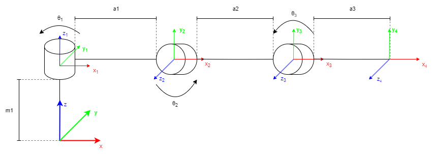

# MotionPlanning

## Overview


The MotionPlanning project is a set of tools and algorithms allowing to plan, calculate and simulate movement of robotic limb in the Hexapod project. Module includes functions solving forward and inverse kinematics problems, generating trajectories within joint space and task space.
Image below visualises currently used model of robotic limb.




## Structure of the Project

- `kinematics`: Central directory providing solvers for kinematics problems with its unitests.

- `trajectories`: Separate directory providing neccessary solvers generating trajectories for the limb using aforementioned kinematics solvers.

## Usage

To make use of the kinematics module, you can import it in your existing project or run it standalone for custom computations.

```python
from kinematics.kinematics import KinematicsSolver
```

<!-- ## Running Tests

To run unit tests, navigate to the root directory of the project and execute:

```bash
pytest
```

Please ensure that your Python environment has the required packages installed. -->
